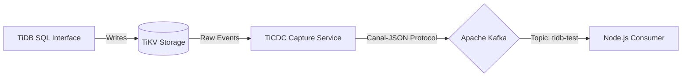

# TiDB Event Streaming Pipeline

Real-time Change Data Capture (CDC) pipeline that captures row-level changes from a distributed TiDB cluster and streams them to Apache Kafka using the Canal-JSON protocol.

## Architecture



## Project Status

| Phase | Description | Status |
|-------|-------------|--------|
| 1. Infrastructure | Docker Compose stack, ARM64 compatibility, Network configuration | ✅ Completed |
| 2. Application | Node.js Kafka consumer implementation | ✅ Implemented |
| 3. Validation | End-to-End data flow verification | 🚧 In Progress |

## Development Process

We followed a bottom-up approach to ensure stability at each layer:

### 1. Infrastructure Layer (Docker)
- **What:** Defined a `docker-compose` stack with TiDB components (PD, TiKV, TiDB, TiCDC) and Kafka (Broker + Zookeeper)
- **Why:** To simulate a distributed production environment locally on macOS/Silicon

### 2. Pipeline Layer (TiCDC)
- **What:** Configured a `changefeed` to capture data from TiKV and push it to Kafka
- **Why:** To establish the "pipe" that automatically moves data events without application logic
- **How:** Used the `ticdc cli` binary inside the container to map the source to the sink (`kafka://...`)

### 3. Application Layer (Node.js)
- **What:** Developed a custom Consumer script using the `kafkajs` client library
- **Why:** To demonstrate how an external application programmatically consumes and processes the data stream
- **How:** Initialized a Node.js project (`npm init`) and implemented the connection/subscription logic in `consumer.js`

## Services Inventory

| Service | Port (Host) | Role |
|---------|-------------|------|
| TiDB | 4000 | SQL Layer (MySQL Compatible) |
| PD | 2379 | Cluster Metadata & Orchestration |
| TiKV | 20160 | Distributed Key-Value Store |
| TiCDC | 8300 | Change Data Capture Engine |
| Kafka | 9092 | Event Streaming Broker |
| Zookeeper | 2181 | Kafka Coordinator |

## Deployment Instructions

### 1. Provision Infrastructure

Start the container stack in detached mode:

```bash
docker-compose up -d
```

### 2. Verify Health Status

Ensure all containers report `Up` status (check specifically for `ticdc` and `kafka`):

```bash
docker-compose ps
```

### 3. Initialize Replication Pipeline

Execute the following command to register the Changefeed task in the TiCDC server:

```bash
docker-compose exec ticdc \
  /cdc cli changefeed create \
  --server=http://ticdc:8300 \
  --sink-uri="kafka://kafka:9092/tidb-test?protocol=canal-json" \
  --changefeed-id="simple-replication-task"
```

### 4. Setup & Run Consumer Application

To start listening for changes, set up the local Node.js environment:

```bash
# 1. Install dependencies (creates node_modules)
npm install

# 2. Run the Consumer script
node consumer.js
```

### 5. Validation (Manual Test)

1. Keep the `consumer.js` terminal running
2. Open a new terminal and connect to the database:

```bash
docker-compose exec tidb mysql -u root -h tidb -P 4000
```

3. Execute SQL commands (`INSERT`, `UPDATE`) and observe the JSON output in the consumer terminal

## Version Control Strategy

The `.gitignore` file excludes:

| Pattern | Reason |
|---------|--------|
| `.DS_Store` | macOS metadata files |
| `node_modules/` | Dependencies installed via `npm install` |
| `.env` | Sensitive environment variables and secrets |

## Tech Stack

- **Database:** TiDB (PD + TiKV + TiDB)
- **CDC:** TiCDC with Canal-JSON protocol
- **Messaging:** Apache Kafka + Zookeeper
- **Application:** Node.js + KafkaJS client
- **Infrastructure:** Docker Compose (Optimized for Apple Silicon / ARM64)