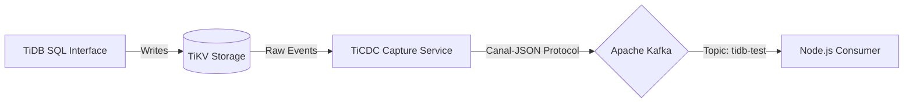

# TiDB Event Streaming Pipeline

Real-time Change Data Capture (CDC) pipeline that captures row-level changes from a distributed TiDB cluster and streams them to Apache Kafka using the Canal-JSON protocol.

## Architecture



## Project Status

| Phase | Description | Status |
|-------|-------------|--------|
| 1. Infrastructure | Docker Compose stack, ARM64 compatibility, Network configuration | ✅ Completed |
| 2. Application | Node.js Kafka consumer implementation, E2E validation | 🚧 Pending |

## Services Inventory

| Service | Port (Host) | Role |
|---------|-------------|------|
| TiDB | 4000 | SQL Layer (MySQL Compatible) |
| PD | 2379 | Cluster Metadata & Orchestration |
| TiKV | 20160 | Distributed Key-Value Store |
| TiCDC | 8300 | Change Data Capture Engine |
| Kafka | 9092 | Event Streaming Broker |
| Zookeeper | 2181 | Kafka Coordinator |

## Deployment Instructions

### 1. Provision Infrastructure

Start the container stack in detached mode:

```bash
docker-compose up -d
```

### 2. Verify Health Status

Ensure all containers report `Up` status:

```bash
docker-compose ps
```

### 3. Initialize Replication Pipeline

Execute the following command to register the Changefeed task in the TiCDC server:

```bash
docker-compose exec ticdc \
  /cdc cli changefeed create \
  --server=http://ticdc:8300 \
  --sink-uri="kafka://kafka:9092/tidb-test?protocol=canal-json" \
  --changefeed-id="simple-replication-task"
```

**Command Breakdown:**
- `docker-compose exec ticdc` - Execute a command inside the running TiCDC container
- `/cdc cli changefeed create` - Binary entrypoint and sub-command to initiate a new replication task
- `--server` - HTTP endpoint of the TiCDC server for management operations
- `--sink-uri` - Destination configuration string:
  - `kafka://kafka:9092` - Protocol and broker address
  - `/tidb-test` - Target Kafka topic name
  - `?protocol=canal-json` - Data serialization format

### 4. Validation

Verify that the changefeed is in `normal` state:

```bash
docker-compose exec ticdc /cdc cli changefeed list --server=http://ticdc:8300
```

## Version Control Strategy

The `.gitignore` file excludes:

| Pattern | Reason |
|---------|--------|
| `.DS_Store` | macOS metadata files |
| `node_modules/` | Dependencies installed via `npm install` |
| `.env` | Sensitive environment variables and secrets |

## Tech Stack

- **Database:** TiDB (PD + TiKV + TiDB)
- **CDC:** TiCDC with Canal-JSON protocol
- **Messaging:** Apache Kafka + Zookeeper
- **Infrastructure:** Docker Compose (Optimized for Apple Silicon / ARM64)