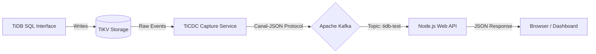

# TiDB Real-Time CDC Pipeline

A real-time data ingestion pipeline that captures row-level changes from a distributed TiDB cluster and streams them to a Node.js Web API via Apache Kafka using the Canal-JSON protocol.

## Architecture



## Project Status

| Phase | Description | Status |
|-------|-------------|--------|
| 1. Infrastructure | Docker Compose stack, ARM64 compatibility, Network configuration | ✅ Completed |
| 2. Pipeline | TiCDC to Kafka changefeed configuration | ✅ Completed |
| 3. Application | Node.js Express Server with Kafka Consumer | ✅ Completed |
| 4. Validation | End-to-End data flow verification via Browser | ✅ Completed |

## Development Process & Technical Decisions

This section details the "Why" and "How" for future reference, specifically focusing on DevOps challenges encountered during implementation.

### 1. Infrastructure Layer (Docker & Networking)

- **Action:** Defined a `docker-compose` stack with TiDB components and Kafka
- **Challenge:** **Kafka Network Isolation** - Kafka requires "Advertised Listeners" to tell clients where to connect. A single address cannot serve both internal Docker containers and the external Host machine (Mac)
- **Solution:** Implemented **Dual Listeners** in Kafka configuration:
  - **Internal Listener (Port 9092):** Used by TiCDC (inside Docker) to push data. Advertises as `kafka:9092`
  - **External Listener (Port 9093):** Used by the Node.js Consumer (on Host) to pull data. Advertises as `localhost:9093`

### 2. Pipeline Layer (TiCDC)

- **Action:** Configured a `changefeed` to capture data from TiKV
- **Why:** TiCDC acts as the replication engine, converting raw Key-Value changes into structured Canal-JSON events
- **Configuration:** Mapped the sink URI to `kafka://kafka:9092` (using the internal listener)

### 3. Application Layer (Node.js & Express)

- **Action:** Developed a Consumer that doubles as a Web Server
- **Why:** To visualize the data stream in a browser (simulating a monitoring dashboard) rather than viewing raw logs in a terminal
- **Logic:**
  - **Ingestion:** Connects to Kafka on port 9093 and pushes incoming events to an in-memory array
  - **Presentation:** Uses `express` to serve the data array as a JSON API on port 3000

### 4. Validation Strategy (Ephemeral Containers)

- **Challenge:** The TiDB server container (`pingcap/tidb`) is a minimal image and does not contain the `mysql` CLI tool. We could not run `docker-compose exec` to insert test data
- **Solution:** Used a temporary Docker container strategy
  - **Command:** `docker run --rm ... mysql ...`
  - **Why:** Instead of installing MySQL tools on the Host machine (polluting the local environment), we spun up a temporary container, attached it to the project's network (`tidb-event-streaming_streaming-net`), executed the SQL, and immediately destroyed the container

## Services Inventory

| Service | Internal Port (Docker) | External Port (Host) | Role |
|---------|------------------------|----------------------|------|
| TiDB | 4000 | 4000 | SQL Layer (MySQL Compatible) |
| PD | 2379 | 2379 | Cluster Metadata & Orchestration |
| TiKV | 20160 | - | Distributed Key-Value Store |
| TiCDC | 8300 | 8300 | Change Data Capture Engine |
| Kafka | 9092 | **9093** | Event Streaming Broker |
| Web API | - | **3000** | Data Visualization Endpoint |

## Deployment Instructions

### 1. Provision Infrastructure

Start the container stack in detached mode:

```bash
docker-compose up -d
```

### 2. Verify Health Status

Ensure all containers report `Up`:

```bash
docker-compose ps
```

### 3. Initialize Replication Pipeline

Execute the following command to register the Changefeed task in the TiCDC server. Note that we point to port 9092 (Internal):

```bash
docker-compose exec ticdc \
  /cdc cli changefeed create \
  --server=http://ticdc:8300 \
  --sink-uri="kafka://kafka:9092/tidb-test?protocol=canal-json" \
  --changefeed-id="simple-replication-task"
```

### 4. Setup & Run Consumer Application

Install dependencies (including Express) and start the server:

```bash
npm install express kafkajs
node consumer.js
```

### 5. End-to-End Validation

1. Open your browser and navigate to: `http://localhost:3000`
   
   *Expectation: You should see a JSON object with status "Online"*

2. Open a new terminal to insert data using a temporary MySQL container:

   > **Note:** Ensure the network name matches your local docker network (usually `folder-name_network-name`)

   ```bash
   docker run -it --rm \
     --network tidb-event-streaming_streaming-net \
     mysql \
     mysql -h tidb -P 4000 -u root
   ```

3. Inside the MySQL shell, execute a transaction:

   ```sql
   CREATE DATABASE IF NOT EXISTS final_test;
   USE final_test;
   CREATE TABLE IF NOT EXISTS messages (id INT PRIMARY KEY, content VARCHAR(50));
   INSERT INTO messages (id, content) VALUES (500, 'Live Web Update');
   ```

4. Refresh the browser at `http://localhost:3000`
   
   *Expectation: The JSON data array should now contain the new row*

## Tech Stack

- **Database:** TiDB (PD + TiKV + TiDB)
- **CDC:** TiCDC with Canal-JSON protocol
- **Messaging:** Apache Kafka + Zookeeper
- **Application:** Node.js + Express + KafkaJS
- **Infrastructure:** Docker Compose (Optimized for Apple Silicon / ARM64)